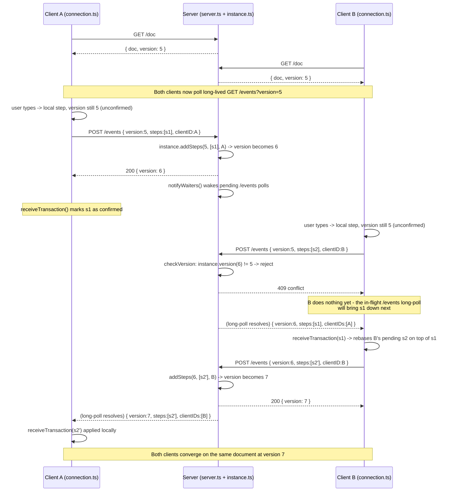
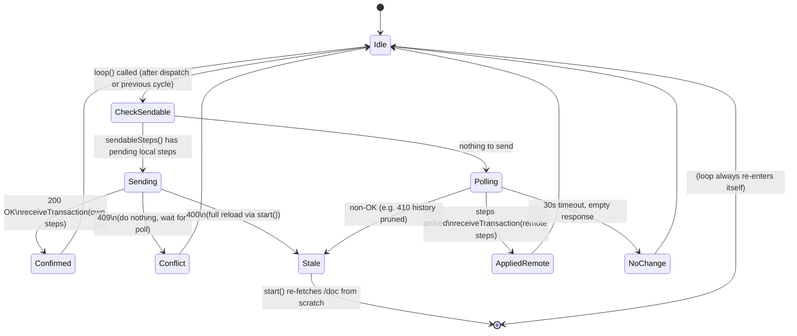

# How prosemirror-collab works in this demo

## The core idea

There is **one authority**: the server. It owns the canonical `version` number
and the canonical document. Every client is just a local replica that:

1. Applies its own edits **optimistically** (instantly, locally).
2. Sends those edits to the server as a list of **steps** tagged with the
   `version` they were based on.
3. If the server's version has moved on since then (someone else committed
   first), the client's steps are rejected. The client must fetch what it
   missed, **rebase** its own pending steps on top, and retry.

`prosemirror-collab` (the plugin) is what tracks "which of my local steps are
still unconfirmed" and does the rebasing math for you via
`sendableSteps` / `receiveTransaction` / `getVersion`.

## Sequence diagram: two clients editing concurrently

## State machine: the client's `loop()`

## Key pieces and where they live

| Concept | Client | Server |
|---|---|---|
| Canonical version | tracked via `getVersion(state)` (plugin-managed) | `instance.version` |
| Pending/unconfirmed steps | tracked via `sendableSteps(state)` (plugin-managed) | n/a (server has no concept of "pending") |
| Rebasing | `receiveTransaction(state, steps, clientIDs)` | n/a — server never rebases, it only accepts-or-rejects |
| History for catch-up | n/a (client only holds current state) | `instance.steps` (capped at `MAX_STEP_HISTORY`) |
| Conflict resolution | retry loop: reject → poll → rebase → resend | reject via `409` if `version !== instance.version` |
| "I've fallen too far behind" | `start()` does a full reload | `410` when `getEventsSince` can't find `startIndex >= 0` |

## Why rebasing works safely

Each step operates on document *positions*. `receiveTransaction` doesn't just
concatenate steps — it maps your own not-yet-confirmed steps forward through
whatever remote steps just arrived, using ProseMirror's `Step.map`/transform
mapping, so insert/delete offsets stay correct even though the document
changed underneath them. This is the same mechanism described in
[Marijn Haverbeke's Collaborative Editing post](https://marijnhaverbeke.nl/blog/collaborative-editing.html).